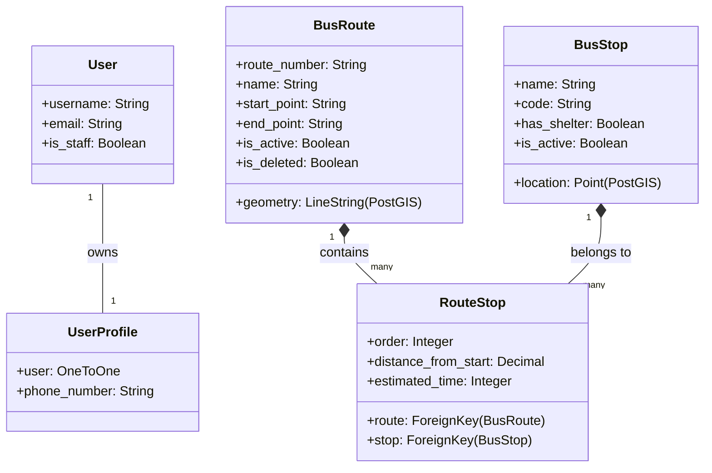

# Sơ đồ Model (ERD Diagram) - WebGIS Quản lý Xe buýt

Dưới đây là mã Mermaid mô tả cấu trúc quan hệ giữa các Model trong dự án của bạn. Bạn có thể dùng mã này để dán vào báo cáo hoặc các công cụ vẽ sơ đồ.

### Hướng dẫn sử dụng:
1.  **Xem trực tiếp:** Mở file này trong VS Code và nhấn `Ctrl + Shift + V`.
2.  **Xuất file ảnh:** Truy cập [Mermaid Live Editor](https://mermaid.live/), dán đoạn mã trên vào để tải về file ảnh định dạng PNG hoặc SVG rất đẹp và sắc nét cho vào báo cáo Word.
